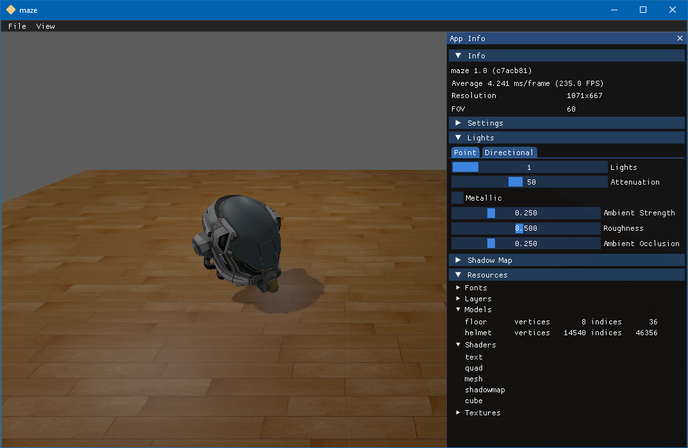

# Maze

A game engine featuring a nice walk through a maze.



## Features

* Platform portability: OpenGL and C++ for Windows, Linux and macOS
* Physically based rendering (PBR)
* Cook-Torrance microfacet specular BRDF
* Point lights and directional light
* Clustered (volume-tiled) light culling
* Exponential variance shadow maps (EVSM) with Dual Kawase blur
* Reinhard tone mapping
* Fast approximate anti-aliasing (FXAA)
* FreeType + HarfBuzz text rendering with LCD subpixel anti-aliasing and subpixel positioning
* Performance profiling with Tracy
* Gamepad support

## Project Organization

```
assets/          # game assets
docs/            # documentation
game/            # source files for maze
sponge/          # source files for sponge game engine
tools/           # tools and utility scripts
```

## Getting Started

For instructions on how to build and run the application, please refer to
the [full documentation](https://tomconder.github.io/maze/)
