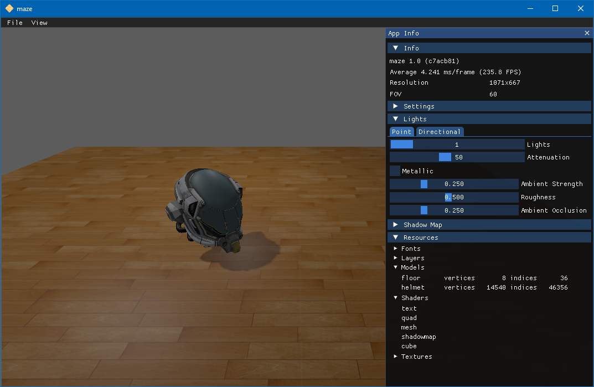

# Maze

A nice walk through a maze.



## Features

* Physically based rendering (PBR)
* Multi-channel signed distance field (MSDF) text rendering
* Platform portability - OpenGL and C++ for Windows and Mac
* Point lights
* HDR
* Performance Profiling with Tracy

## Project Organization

    assets/          # game assets
    docs/            # documentation
    game/            # source files for maze
    sponge/          # source files for sponge game engine
    tools/           # tools and utility scripts

## Installing

Clone this repository.

```
git clone https://github.com/tomconder/maze.git
```

### Install vcpkg

[Install vcpkg](https://github.com/microsoft/vcpkg#getting-started), a dependency and package manager for C++.

By far the quickest way to install vcpkg is to clone it into this project.

```
cd maze
git clone https://github.com/microsoft/vcpkg.git
cd vcpkg
bootstrap-vcpkg.bat
cd ..
setx VCPKG_ROOT vcpkg
```

If you installed vcpkg elsewhere, add an environment variable called `VCPKG_ROOT` that contains the location where you
installed vcpkg.

```
setx VCPKG_ROOT <path to vcpkg>
```

### Install CMake

[Install CMake](https://cmake.org/install/), a cross-platform build system.

For example, use [Chocolatey](https://chocolatey.org/install) to install CMake.

```
choco install cmake
```

## Building

Now you can use a preset to compile `maze`. Possible values
are: `x64-debug`, `x64-release`, `osx-debug`, `osx-release`

On Windows, you can use

```
cmake -B build -DCMAKE_BUILD_TYPE=Release --preset x64-release
cmake --build build --config Release --target install game
```

Or, for MacOS, you can use

```
cmake -B build -DCMAKE_BUILD_TYPE=Release --preset osx-release
cmake --build build --config Release --target install game
```

## Running

The maze executable will be found in the build directory: `out\build\x64-release\maze\Release\maze.exe`
