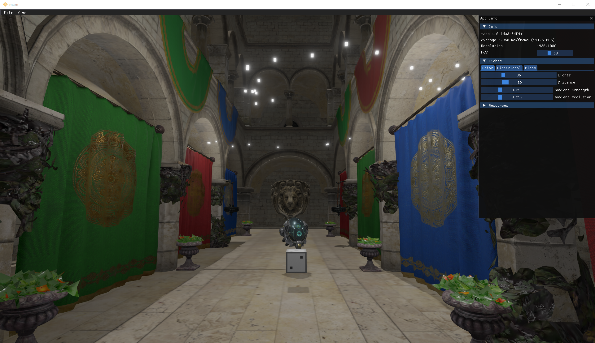

# Maze

A game engine featuring a nice walk through a maze.



## Features

* Platform portability: OpenGL and C++ for Windows and Linux
* Physically based rendering (PBR)
* Cook-Torrance microfacet specular BRDF
* glTF 2.0 materials: albedo, normal, occlusion, emissive and metallic-roughness maps, with KHR_texture_transform
* Point lights and directional light
* Clustered (volume-tiled) light culling
* Exponential variance shadow maps (EVSM) with Dual Kawase blur
* Reinhard tone mapping
* Physically based bloom
* Selectable anti-aliasing: FXAA or temporal (TAA)
* Shaders written in Slang, compiled at build time into one shader pack
* Build-time asset converter: glTF 2.0 and Wavefront OBJ models baked to an engine format, so the game links no asset parser
* BC7 and BC5 texture compression with mipmaps in KTX2, encoded on every core
* UI icons packed into a sprite atlas
* LCD subpixel text with subpixel positioning, rasterized with FreeType and shaped with HarfBuzz at build time
* Flexbox-based UI layout with Yoga
* Audio playback with miniaudio
* Draggable slider widget for Master/Sfx/Music volume, with mouse, keyboard and gamepad support
* Performance profiling with Tracy
* Gamepad support
* Dear ImGui debug and options UI
* Third-party license notices assembled at build time and shipped with the game

## Project Organization

```
assets/          # game assets
docs/            # documentation
game/            # source files for maze
sponge/          # source files for sponge game engine
tools/           # tools and utility scripts, including the assetconv asset converter
```

## Installing

Clone this repository.

```
git clone https://github.com/tomconder/maze.git
```

### Install vcpkg

> The `VCPKG_ROOT` environment variable must be set so that CMake can find vcpkg to install dependencies for the build.

[Install vcpkg](https://github.com/microsoft/vcpkg#getting-started), a dependency and package manager for C++.

By far the quickest way to install vcpkg is to clone it into this project.

```
cd maze
git clone https://github.com/microsoft/vcpkg.git
cd vcpkg
bootstrap-vcpkg.bat
cd ..
setx VCPKG_ROOT vcpkg
```

If you installed vcpkg elsewhere, add an environment variable called `VCPKG_ROOT` that contains the location where you
installed vcpkg.

```
setx VCPKG_ROOT <path to vcpkg>
```

### Install CMake

Use a package manager to install [CMake](https://cmake.org/), a cross-platform build system, on your platform.

For example, on Windows use [WinGet](https://learn.microsoft.com/en-us/windows/package-manager/winget/) to install
CMake.

```
winget install cmake
```

## Building

Use a configuration preset to compile `maze`. Possible values are:

| Preset                 | Description                          |
|------------------------|--------------------------------------|
| `ci-linux-debug`       | Linux debug build                    |
| `ci-linux-release`     | Linux release build                  |
| `ci-osx-debug`         | MacOS debug build                    |
| `ci-osx-release`       | MacOS release build                  |
| `ci-windows-debug`     | Windows debug build (uses sccache)   |
| `ci-windows-release`   | Windows release build (uses sccache) |
| `windows-msvc-debug`   | Windows MSVC debug build             |
| `windows-msvc-release` | Windows MSVC release build           |

To use the preset on Windows:

```
cmake.exe -B build --preset windows-msvc-release
cmake.exe --build build --target game --config Release
```

## Running

On Windows, you can find the maze executable will be found in the build directory.

```
build\maze\Release\maze.exe
```

Or, for MacOS, the app bundle will be found in the build directory.

```
build/maze/maze.app
```
