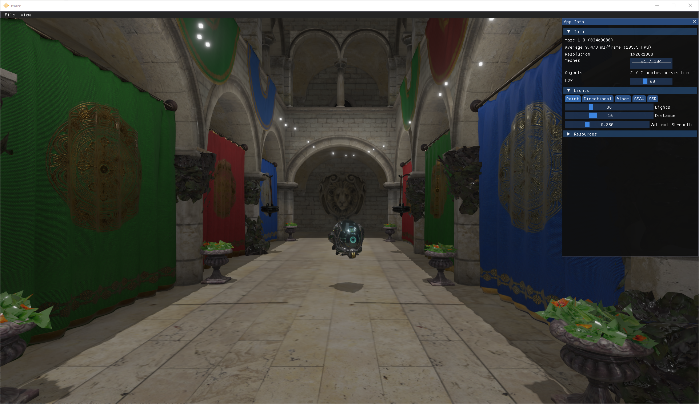

# Maze

A game engine featuring a nice walk through a maze.



## Features

* Platform portability: OpenGL and C++ for Windows and Linux
* Physically based rendering (PBR)
* Cook-Torrance microfacet specular BRDF
* Specular anti-aliasing: the highlight widens with the screen-space variance of the normal, so sub-pixel highlights do not sparkle
* glTF 2.0 materials: albedo, normal, occlusion, emissive and metallic-roughness maps, with KHR_texture_transform
* Point lights and directional light
* Clustered (volume-tiled) light culling
* Exponential variance shadow maps (EVSM) with Dual Kawase blur
* Reinhard tone mapping
* Physically based bloom
* Screen-space ambient occlusion (SSAO)
* Screen-space reflection (SSR) for objects marked `reflective` in the scene file
* Planar reflection for flat mirrors
* Reflection probe with box-projected specular reflections
* Screen-space refraction for glass objects, with index of refraction, thickness and tint
* Camera frustum and hardware occlusion culling
* Selectable anti-aliasing: FXAA or temporal (TAA)
* Shaders written in Slang, compiled at build time into one shader pack
* Build-time asset converter: glTF 2.0 and Wavefront OBJ models baked to an engine format, so the game links no asset parser
* BC7 and BC5 texture compression with mipmaps in KTX2, encoded on every core
* UI icons packed into a sprite atlas
* LCD subpixel text with subpixel positioning, rasterized with FreeType and shaped with HarfBuzz at build time
* Flexbox-based UI layout with Yoga
* Audio playback with miniaudio
* Draggable slider widget for Master/Sfx/Music volume, with mouse, keyboard and gamepad support
* Performance profiling with Tracy
* Gamepad support
* Dear ImGui debug and options UI
* Third-party license notices assembled at build time and shipped with the game

## Project Organization

```
assets/          # game assets
docs/            # documentation
game/            # source files for maze
sponge/          # source files for sponge game engine
tools/           # tools and utility scripts, including the assetconv asset converter
```

## Installing

Clone this repository.

```
git clone https://github.com/tomconder/maze.git
```

### Install vcpkg

> The `VCPKG_ROOT` environment variable must be set so that CMake can find vcpkg to install dependencies for the build.

[Install vcpkg](https://github.com/microsoft/vcpkg#getting-started), a dependency and package manager for C++.

By far the quickest way to install vcpkg is to clone it into this project.

```
cd maze
git clone https://github.com/microsoft/vcpkg.git
cd vcpkg
bootstrap-vcpkg.bat
cd ..
setx VCPKG_ROOT vcpkg
```

If you installed vcpkg elsewhere, add an environment variable called `VCPKG_ROOT` that contains the location where you
installed vcpkg.

```
setx VCPKG_ROOT <path to vcpkg>
```

### Install CMake

Use a package manager to install [CMake](https://cmake.org/), a cross-platform build system, on your platform.

For example, on Windows use [WinGet](https://learn.microsoft.com/en-us/windows/package-manager/winget/) to install
CMake.

```
winget install cmake
```

## Building

Use a configuration preset to compile `maze`. Possible values are:

| Preset                 | Description                          |
|------------------------|--------------------------------------|
| `ci-linux-debug`       | Linux debug build                    |
| `ci-linux-release`     | Linux release build                  |
| `ci-osx-debug`         | MacOS debug build                    |
| `ci-osx-release`       | MacOS release build                  |
| `ci-windows-debug`     | Windows debug build (uses sccache)   |
| `ci-windows-release`   | Windows release build (uses sccache) |
| `windows-msvc-debug`   | Windows MSVC debug build             |
| `windows-msvc-release` | Windows MSVC release build           |

To use the preset on Windows:

```
cmake.exe -B build --preset windows-msvc-release
cmake.exe --build build --target game
```

## Running

On Windows, you can find the maze executable will be found in the build directory.

```
build\maze\maze.exe
```

Or, for MacOS, the app bundle will be found in the build directory.

```
build/maze/maze.app
```

Run `maze` from its own directory. It loads its assets from a path that is relative to the working directory. From any
other directory no assets load and the window stays grey.

### Command line arguments (debug builds)

> These arguments exist only in debug builds. A release build ignores them and starts normally.

A capture run skips the splash and intro screens and loads the maze. It uses a fixed 1600x900 window with vsync off, so
runs compare. The camera turns once over the run. The run writes its results to the working directory and then exits.

| Argument                  | Description                                                                                                                                                     |
|---------------------------|-----------------------------------------------------------------------------------------------------------------------------------------------------------------|
| `--capture-frames N`      | Render `N` frames and exit. `--capture-frames=N` also works. A missing, zero or non-numeric `N` gives the normal start.                                         |
| `--dump-nan-stats`        | Scan every stage on every frame for NaN, Inf and isolated bright or dark pixels. `N` defaults to 600 when `--capture-frames` is not given.                      |
| `--capture-off=a,b`       | Turn passes off for the run. Use a comma-separated list of: `aa`, `bloom`, `ssao`, `ssr`, `shadow`, `probe`, `planar`.                                          |

Examples:

```
maze.exe --capture-frames 600
maze.exe --capture-frames=600 --dump-nan-stats
maze.exe --capture-frames 1500 --capture-off=ssao,bloom
```

#### Output files

| File                                    | Written when                                 | Content                                                                                                                                                              |
|-----------------------------------------|----------------------------------------------|----------------------------------------------------------------------------------------------------------------------------------------------------------------------|
| `capture_<stage>_last.pfm`              | Always                                       | The last frame of each stage as a float image. Stages: `scene` and `bloom` (RGB16F, linear radiance), `tonemap` (the input of FXAA or TAA) and `taa` (0 to 1), `backbuffer` (8-bit). |
| `capture_timing.txt`                    | Without `--dump-nan-stats`                   | Mean, p50 and p95 frame time and FPS. The first 60 frames (warm-up) and the last frame (readback) are left out.                                                      |
| `capture_stats.txt`                     | Always                                       | One line per stage: NaN, Inf, values over 1000, bright and dark specks, highest finite value and the first hit.                                                      |
| `capture_specks.txt`                    | Always                                       | The frame and pixel of each speck in the `scene` stage.                                                                                                              |
| `capture_<stage>_first_hit.pfm`         | A stage has a hit                            | The first frame of that stage that has a NaN, Inf or speck.                                                                                                          |

Notes:

* The back buffer cannot show NaN: it reads as black. Use the float stages.
* A stage read stalls the GPU. Without `--dump-nan-stats`, only the last frame is read, so the frame times stay valid.
  With `--dump-nan-stats`, every frame stalls, and no timing file is written.
* Debug builds run slower than release builds, and the CPU cost is higher. Use a capture run to compare passes with each
  other, not to measure the speed of a release build. A 600-frame `--dump-nan-stats` run takes minutes.
